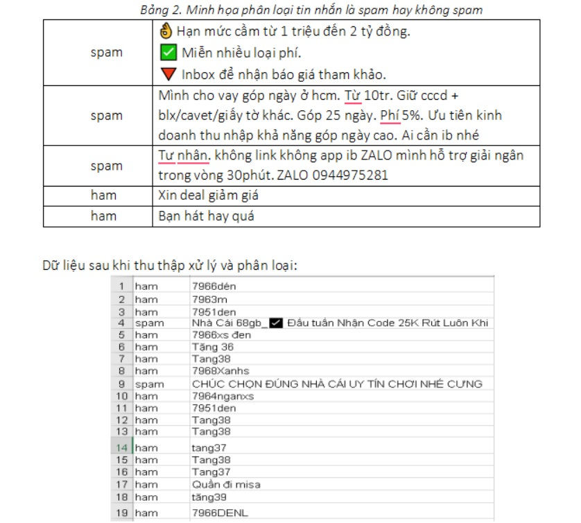
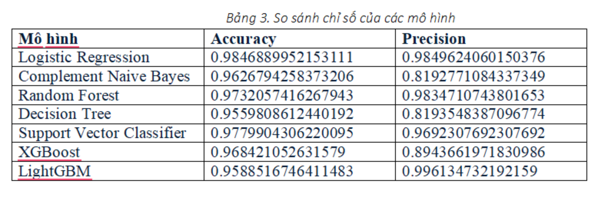
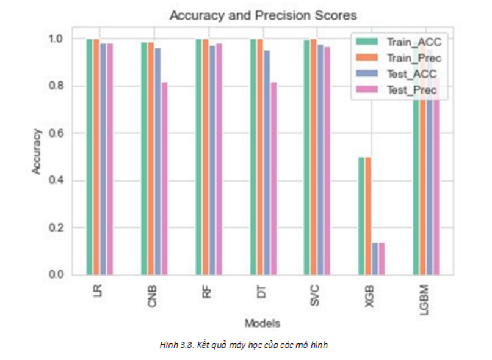
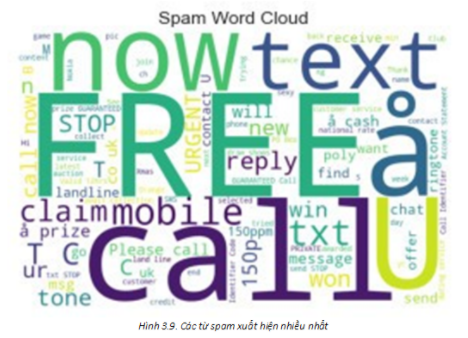

# 📩 Spam Message Classification System

> An end-to-end Machine Learning project for SMS spam detection using multiple supervised learning algorithms and Apache Kafka for real-time message streaming.


---

# 📖 Overview

Spam SMS messages are one of the most common forms of unwanted communication. This project develops a complete Machine Learning pipeline capable of automatically classifying SMS messages into **Spam** and **Ham (Non-Spam)**.

The system covers the entire workflow, including data preprocessing, TF-IDF feature extraction, model training, performance evaluation, and Apache Kafka integration for streaming message processing.

---

# ✨ Features

- 📩 SMS Spam Classification
- 🧹 Text preprocessing
- 🔤 TF-IDF feature extraction
- 🤖 Seven supervised Machine Learning models
- 📊 Performance comparison and evaluation
- 📡 Apache Kafka streaming integration

---

# 🛠 Tech Stack

| Category | Technologies |
|----------|--------------|
| Programming Language | Python |
| Machine Learning | Scikit-learn |
| Data Processing | Pandas, NumPy |
| Feature Engineering | TF-IDF |
| Streaming | Apache Kafka |
| Models | Logistic Regression, Complement Naive Bayes, Decision Tree, Random Forest, Support Vector Classifier (SVC), XGBoost, LightGBM |

---

# 🔄 Machine Learning Workflow

```text
Dataset
      │
      ▼
Data Cleaning
      │
      ▼
Text Preprocessing
      │
      ▼
TF-IDF Feature Extraction
      │
      ▼
Model Training
      │
      ▼
Performance Evaluation
      │
      ▼
Spam Prediction
```

---

# 📂 Dataset

The dataset contains SMS messages labeled into two classes:

- 📩 Spam
- ✅ Ham (Non-Spam)

After preprocessing, the text data is transformed into numerical vectors using **TF-IDF Vectorization** before training the machine learning models.

## Sample Dataset

<p align="center">

</p>

---

# 🤖 Machine Learning Models

The following supervised learning algorithms were implemented and evaluated:

| Model | Status |
|--------|--------|
| Logistic Regression | ✅ |
| Complement Naive Bayes | ✅ |
| Decision Tree | ✅ |
| Random Forest | ✅ |
| Support Vector Classifier (SVC) | ✅ |
| XGBoost | ✅ |
| LightGBM | ✅ |

---

# 🏆 Key Results

- Successfully implemented and evaluated **7 Machine Learning models**.
- Achieved **98.47% Accuracy** using **Logistic Regression**.
- Compared multiple algorithms based on Accuracy and Precision.
- Integrated Apache Kafka for real-time message streaming.

---

# 📊 Experimental Results

The performance of each model was evaluated using:

- Accuracy
- Precision
- Recall
- F1-score

## Performance Comparison

<p align="center">

</p>

The comparison demonstrates that **Logistic Regression** achieved the highest overall accuracy on the dataset, while ensemble learning models such as **Random Forest**, **XGBoost**, and **LightGBM** also delivered competitive performance.

---

## Performance Visualization

The following chart compares the training and testing performance of all implemented models.

<p align="center">

</p>

---

# ☁️ Word Cloud Analysis

To better understand the characteristics of spam messages, a Word Cloud was generated based on the dataset.

Frequently occurring words such as **FREE**, **CALL**, **NOW**, and **TEXT** appear prominently, reflecting common patterns found in spam SMS messages.

<p align="center">

</p>

---

# 📡 Apache Kafka Integration

Apache Kafka was integrated into the project to simulate real-time message streaming.

The workflow consists of:

- Producer publishes incoming SMS messages.
- Kafka transports messages.
- Consumer receives messages.
- The trained Machine Learning model predicts whether the message is Spam or Ham.

This architecture demonstrates how Machine Learning models can be deployed in a streaming environment.

---

# 🚀 Future Improvements

- Deploy the trained model as a REST API.
- Dockerize the application.
- Apply Deep Learning models such as LSTM and BERT.
- Deploy on cloud platforms.
- Build a web-based interface for real-time spam detection.

---

# 📁 Project Structure

```text
message_spam_detection
│
├── data/
├── models/
├── notebooks/
├── producer/
├── consumer/
├── training/
├── evaluation/
├── images/
└── README.md
```

---

# 👨‍💻 Author

**Van Anh**

Software Engineer

Interested in Backend Engineering, Artificial Intelligence, and Distributed Systems.

If you find this project interesting, feel free to ⭐ the repository.
